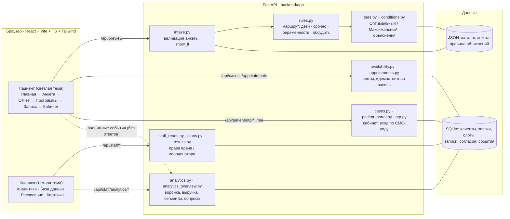
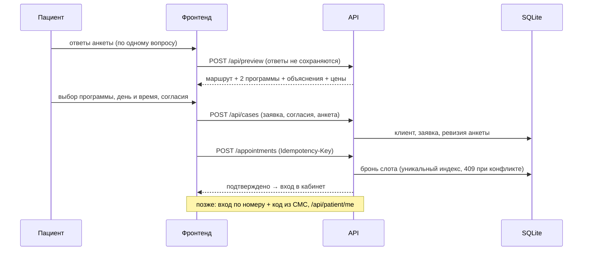

# Green Clinic · Умный чек-ап

**Команда:** Форточка - Ален Исаев, Диар Бегисбаев, Мадина Оразалиева

Кейс №2 хакатона — Check-up Intelligence для PRIME Green Clinic (Астана, [primegc.kz](https://primegc.kz/)).

## Проблема

На сайте клиники пять программ чек-апа (мужской/женский базовый до 40, расширенный после 40, детский). Пациенту сложно понять, какая подходит именно ему, зачем в программе те или иные исследования и что делать после записи. Клиника, в свою очередь, не видит, на каком шаге люди уходят и какие факторы здоровья чаще всего встречаются у будущих пациентов.

## Решение

Веб-приложение из двух частей на одном бэкенде.

**Пациенту** (светлая тема):
1. Главная с выбором языка (қазақша / русский) и входом в личный кабинет.
2. Короткая анкета — по одному вопросу на экран, 9–13 вопросов с ветвлением: вопрос о беременности видят только женщины 18–55 лет, уточнения — только при ответе «да». Досрочные выходы: младше 18 — детский чек-ап, срочный симптом — экран 103 / 112.
3. Подбор на правилах, без ИИ-«чёрного ящика»: две программы клиники «Оптимальный | Максимальный», объяснения «почему так» по сочетаниям ответов и таблица «что входит».
4. Запись к терапевту: календарь, свободное время, согласие на передачу данных в клинику и СМС-напоминание; по номеру телефона автоматически создаётся личный кабинет.
5. Личный кабинет: этапы пути, запись, подготовка к исследованиям, результаты, повторные визиты. Вход — номер телефона и код из СМС.

**Клинике** (тёмная тема):
- Клиенты — список и доска по этапам, карточка клиента с правами по роли: анкету видит только врач, координатор ведёт организационные поля.
- Расписание терапевта по дням.
- Аналитика: ключевые показатели, воронка «визит → анкета → программы → запись», популярные программы и факторы, пол и возраст, загрузка терапевта, и отдельно по каждому вопросу — показы, ответы, уход и распределение ответов.

### Как работает подбор

| Возраст | Оптимальный | Максимальный |
|---|---|---|
| 18–39 | Базовый до 40 своего пола | Расширенный после 40 — по согласованию с врачом |
| 40 | Базовый | Расширенный; выбор вместе с терапевтом |
| 41+ | Расширенный после 40 | Тот же пакет, дополненный темами для терапевта по ответам |

Порядок правил: младше 18 → детский путь; срочный симптом → 103/112; беременность → «обсудить с терапевтом»; жалобы, хронические болезни, постоянные лекарства → «обсудить»; иначе обычная запись. «Максимальный» рекомендуется, когда ответы указывают на исследования, которые есть только в расширенной программе (например, онкология у родственников, жалобы на пищеварение, почки). Правила и тексты лежат в `data/explanations.json` и `backend/app/tiers.py`; все сценарии покрыты тестом `tests/rules_matching/test_use_cases.py`.

## Демо

Локально: `http://<хост>:5174/`.

| Кто | Как войти |
|---|---|
| Администратор клиники (права врача и координатора) | «Войти в кабинет» → `+7 777 777 77 77`, код `0000`, или ссылка «Для сотрудников клиники» внизу главной |
| Пациенты с готовыми данными | `+7 700 000 00 01` … `08`, код `0000` (05 — подготовка, 07 — результаты, 08 — повторы) |
| Новый пациент | Пройти анкету → записаться → кабинет создаётся автоматически |

В демо-режиме СМС не отправляются, код всегда `0000`. Для показа аналитики база заполняется синтетическими клиентами и визитами.

## Запуск

Требования: Python 3.10+, Node.js 18+.

```bash
# бэкенд
python3 -m venv .venv
.venv/bin/pip install -r backend/requirements.txt
.venv/bin/uvicorn app.main:app --app-dir backend --host 127.0.0.1 --port 8010

# фронтенд (в другом терминале)
cd frontend
npm ci
npx vite --host 0.0.0.0 --port 5174   # /api проксируется на 127.0.0.1:8010

# тесты и сборка
.venv/bin/pytest
cd frontend && npx tsc -p tsconfig.json --noEmit && npx vite build
```

Переменные окружения (секретов в репозитории нет):

| Переменная | По умолчанию | Назначение |
|---|---|---|
| `PRIME_DEMO` | `1` | Демо-режим: код входа `0000`, демо-вход сотрудников. `0` — выключить |
| `PRIME_DB` | `data/demo.sqlite` | Путь к базе SQLite |
| `PRIME_SYNTHETIC` | авто | `1` — заполнить базу синтетическими клиентами для аналитики |
| `SMS_PROVIDER` | `log` | Провайдер СМС; `log` ничего не отправляет |
| `OTP_PEPPER` | dev-значение | Секрет для хэширования кодов — обязательно задать в проде |

## Архитектура



Путь данных пациента:



## Структура проекта

```
backend/app/        FastAPI: анкета и правила (rules.py, tiers.py, conditions.py),
                    запись (availability.py, appointments.py), кабинет и вход по СМС
                    (patient_portal.py, otp.py), клиника (staff_reads.py, plans.py,
                    results.py), аналитика (analytics.py, analytics_overview.py)
data/               каталог программ с сайта, анкета, правила объяснений, фикстуры
frontend/src/       React + Vite + TypeScript + Tailwind
  features/         экраны: patient-home, intake, overview, recommendations,
                    booking, cabinet, staff
  components/       общий каркас пациента и рабочего места (AppShell)
tests/              pytest: правила, сценарии пациентов, запись, вход, права, аналитика
```

## Что готово

- Полный путь пациента: анкета с ветвлением → подбор → запись → личный кабинет, на русском и казахском.
- Правила подбора с объяснениями и автотестами на 16 типичных сценариев.
- Запись с защитой от двойного бронирования и конфликтов слота.
- Вход по номеру и коду: коды хранятся в виде хэша, срок жизни 5 минут, лимиты повторной отправки и попыток. Запись на чужой номер не открывает чужие данные.
- Рабочее место клиники: клиенты, карточка, расписание, аналитика, разделение прав врача и координатора.
- 90+ тестов бэкенда, типизация фронтенда.

Известные ограничения:
- На primegc.kz цены не опубликованы: для демо взяты цены похожих пакетов с greenclinic.kz, скидка на расширенных программах — демонстрационная. Перед запуском заменить прейскурантом PRIME (`data/catalogue.real.json`).
- Состав программ перенесён с сайта и клиникой не утверждён; правила подбора — черновик для обсуждения с врачами, это не диагноз и не медицинское назначение.
- Нет интеграции с МИС клиники и реального провайдера СМС; расписание терапевта синтетическое.
- Вход сотрудников в демо-режиме без пароля.
